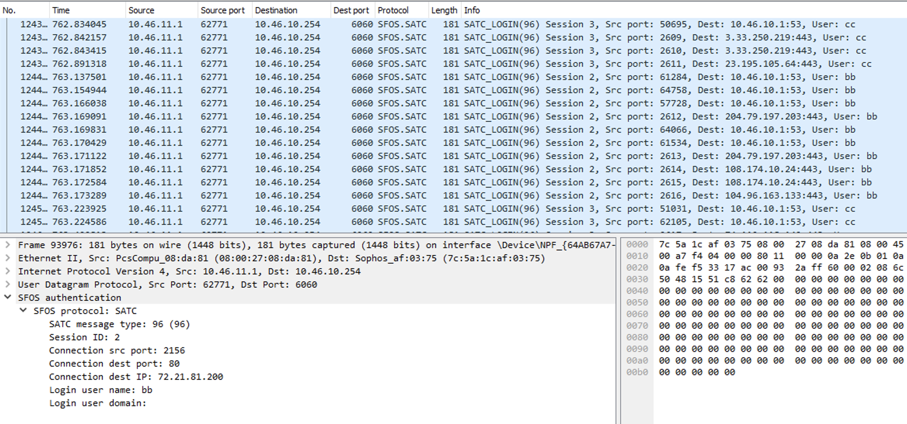

# sfos-wireshark
A wireshark plugin to detect and decode data packets created by SFOS and associated tools

It currently supports:
- SATC protocol, used by the Sophos Endpoint agent on Windows to communicate information about the user account in which each network connection was created
- STAS protocol, used by the Sophos Firewall to communicate with STAS Agents and Collectors to find out about user logins associated with local IP addresses

It adds a number of dissected data fields to Wireshark that can be used for filtering packets and displaying in Wireshark's tabular view of packets. These all come under the following hierarchy:

- sfos.stas.*
- sfos.satc.*

To use this plugin on your Wireshark installation, download the attached lua file and put it into your Wireshark plugin folder.

For Windows users, you should have, or create, a folder at `%APPDATA%\Wireshark\plugins`

For Mac or Linux users, you can put it at `~/.local/lib/wireshark/plugins/`

You can also install it as a global plugin. I'll leave it to you to work out how to do that.
